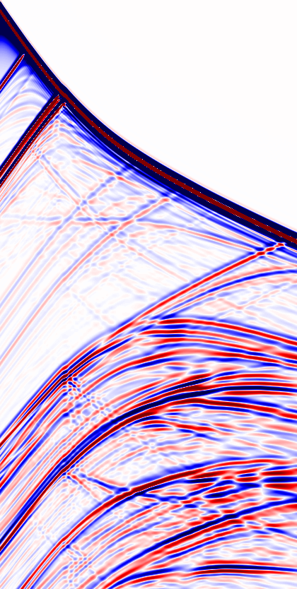

# SEGY Wrapper
A SEGY Wrapper for forward modeling propagators, like Deepwave.

Use the Jupyter notebook to see a full interactive example, or use the tooth_wrap script to directly run the example.

Start from a velocity model in SEGY, run your propagator, output the shot results in SEGY. The open source BP "tooth model" is used in this benchmark.

Picture of a synthetic shot, simulating a surface survey.

Picture of a synthetic VSP, simulating a downhole acquistion survey.
