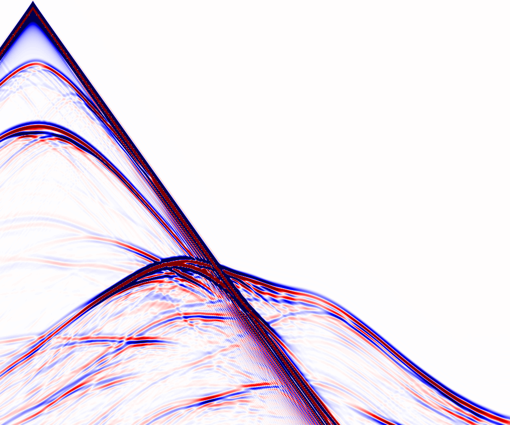

# SEGY Wrapper
A SEGY Wrapper for forward modeling propagators, like Deepwave.

Use the Jupyter notebook to see a full interactive example, or use the tooth_wrap scrip to directly run the example.

Start from a velocity model in SEGY, run your propagator, output the Shot results in SEGY.

